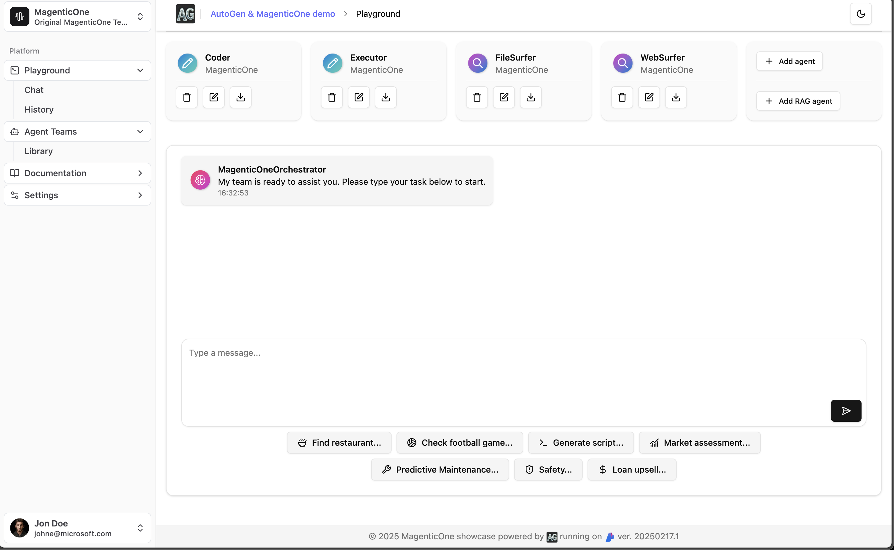

[](http://makeapullrequest.com)
[](https://www.linkedin.com/in/yaniv-vaknin-7a8324178/)

# Build your dream team with Autogen

This repository is a part of the Azure Samples collection and utilizes Microsoft Autogen 0.4 alongside Azure OpenAI. It seamlessly integrates with a React UI to create a comprehensive end-to-end multi-agent application. Designed for simplicity, this repository streamlines the process of building, testing, and deploying an advanced multi-agent framework. [Magentic One](https://www.microsoft.com/en-us/research/articles/magentic-one-a-generalist-multi-agent-system-for-solving-complex-tasks/)
 


:tada: February 25, 2025: We have a new React based UI with new business use cases

:tada: January 11, 2025: The repo now support [Autogen 0.4.0 stable version](https://microsoft.github.io/autogen/stable/)

:tada: December 3, 2024: The repo now support one click deployment with [Azure Developer CLI](https://learn.microsoft.com/en-us/azure/developer/azure-developer-cli/), if you would like to run it with the full process localy you can check [v0.21](https://github.com/yanivvak/dream-team/tree/v0.21)

:tada: November 18, 2024: we are porting this repo to  [Autogen 0.4](https://microsoft.github.io/autogen/0.4.0.dev6/index.html), A new event driven, asynchronous architecture for AutoGen and [Magentic One](https://github.com/microsoft/autogen/tree/main/python/packages/autogen-magentic-one)


https://github.com/user-attachments/assets/e3f1bbae-a93b-47d8-b661-b6a9507c243b


# Key Features

Dream Team offers the following key features:

- **Advanced multi agent framework**: this solution is based on the popular framework Autogen(35K stars) and Magentic One
- **Friendly UI**: easy way to build and share data apps powered by React / Vite.js / Tailwind / Shadcn
- **Single line deployment**: developer-friendly deployment that accelerates your path from a local development environment to Azure with single line of code - azd up.
- **Secure code execution**:  Fast access to secure sandboxed with strong isolation environments that are ideal for running code or applications with Azure Container Apps dynamic sessions.
- **Managed Identities**: Built in Azure Managed identities to eliminate the need for developers to manage these credentials
- **Observability & Debugging**: Built-in features and tools for tracking, tracing, and debugging agent interactions and workflows, including PromptFlow tracing.


# Prerequisites:

1. Install [Azure Developer CLI](https://learn.microsoft.com/en-us/azure/developer/azure-developer-cli/install-azd?tabs=winget-windows%2Cbrew-mac%2Cscript-linux&pivots=os-windows).
2. Ensure you have access to an Azure subscription
3. Docker - Follow the [official Docker installation instructions](https://docs.docker.com/get-started/get-docker/) - make sure your docker is loged in (docker login -u "username" -p "password"
 )
4. Python version >= 3.10, < 3.13
5. Install [UV](https://github.com/astral-sh/uv?tab=readme-ov-file#installation) - optional for running locally


# Step by step deployment
   
## 1. Clone the repository     
```bash  
git clone https://github.com/Azure-Samples/dream-team  
```
## 2. Login to your Azure account
```bash
azd auth login
```
> You need to choose your preferred region (you can start with east us or sweden central or any other available region)

## 3. Deploy Azure Resources and the app

```bash
azd up
```

## 4. [Optional] Ingest the demo documents into your AI Search

In case you want to use the demo data, you can run the ingestion script to populate your AI Search with the demo data. This step is optional and is only needed if you want to use the demo data.

```bash
cd backend
python -m aisearch.py
```

> Notes:
> 1. This step assumes you have already setup your infrastructure and your local `.env` file has been populated with the necessary values.
> 2. Make sure your identity has appropriate acccess to AI Search (role `Search Index Data Contributor`) and to created storage (role `Storage Blob Data Contributor`), otherwise you will get an error when running the ingestion script.
> 3. This creates four indexes: ag-demo-fsi-upsell, ag-demo-pred-maint, ag-demo-retail, ag-demo-safety

# Notes 
- While using Web Surfer agent, you might want to change Content Safety on Azure OpenAI to accomodate your needs
- currently it is "bring your own AI Search" (BYOS) - since its assuming you have your own search engine, we are working on a solution to make it easier for you
   - you must add two ENV variables to backend service to connect to your search engine
   - `AZURE_SEARCH_SERVICE_ENDPOINT` - your search engine endpoint
   - `AZURE_SEARCH_ADMIN_KEY` - your search engine key (we are working to enable managed identity for this service)
 

# Working locally  

There are two parts to this project: the backend and the frontend. The backend is written in Python, and the frontend is written in JavaScript using React.

## Backend

```bash  
cd backend  
```
Set up a virtual environment (Preferred)
```bash
uv venv
```
Once you’ve created a virtual environment, you may activate it.

On Windows, run:
```bash
.venv\Scripts\activate
```
On Unix or MacOS, run:
```bash
source .venv/bin/activate
```
To deactivate :
```bash
deactivate
```
> More information about virtual environments can be found [here](https://docs.python.org/3/tutorial/venv.html)

### Install dependencies
```bash
uv sync
playwright install --with-deps chromium
```

> Important: Magentic-One code uses code execution, you need to have Docker installed to run the examples if you use local execution

### Run
```bash
uvicorn main:app --reload
```

## Frontend (open a new terminal)
```bash
cd frontend
```
> Upadte the env variables in sample.env and rename to .env

## Run
```bash
npm run dev
```
If your app is ready, you can browse to (typically) http://localhost:8501 to see the app in action.


# Learn
Check these resources:
1. [Blogpost](https://techcommunity.microsoft.com/blog/Azure-AI-Services-blog/build-your-dream-team-with-autogen/4157961) - Build your dream team with Autogen
2. [Webinar](https://youtu.be/wB9gD9FkgNA?si=WU3H0QL37RCiTGvl) - More agents is all you need
